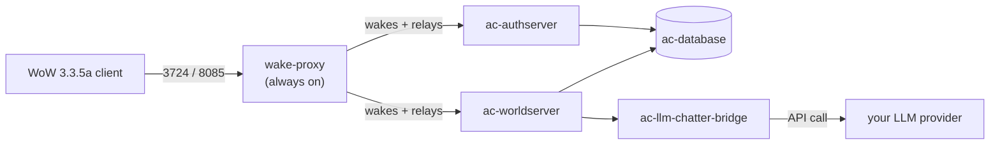

# wow-server-playerbots

[](https://github.com/estebanmorenoit/wow-server-playerbots/actions/workflows/ci.yml)
[-4a5dc7)](#connecting-a-client)
[](https://www.azerothcore.org/)
[](./docker-compose.yml)
[](https://hub.docker.com/r/estebanmorenoit/ac-wotlk-worldserver-playerbots)
[](./LICENSE)

Self-hosted **World of Warcraft: Wrath of the Lich King (3.3.5a, build 12340)** private server, built on [AzerothCore](https://www.azerothcore.org/) — solo-play focused, populated by AI bots instead of real players.

Not affiliated with Blizzard Entertainment. For personal/private-server use.

[MIT](./LICENSE) covers what's actually authored in this repo — `deploy.sh`, `backup.sh`, `wake-proxy/`, `docker-compose.yml`, this README. It does *not* cover AzerothCore or the nine modules, which `deploy.sh` clones separately at deploy time straight from their own repos, each under its own license (mostly AGPL-3.0/GPL-2.0) — check those repos directly if that matters for your use case.

## Contents

- [What's running](#whats-running)
- [Prebuilt images](#prebuilt-images)
- [Quick start](#quick-start)
- [Connecting a client](#connecting-a-client)
- [Modules in detail](#modules-in-detail)
- [GM commands reference](#gm-commands-reference-this-build)
- [Operations](#operations)
- [Known issues](#known-issues)

---

## What's running

- **Core**: AzerothCore (fork: [`mod-playerbots/azerothcore-wotlk`](https://github.com/mod-playerbots/azerothcore-wotlk), Playerbot branch)
- **Database**: MySQL 8.4 (official `mysql:8.4` image — not customized)
- **Orchestration**: Docker Compose
- **Auto-sleep / wake-on-connect**: the game stack sits fully stopped when nobody's playing and wakes itself the moment a client connects — see [Auto-sleep / wake-on-connect](#auto-sleep--wake-on-connect). Practical effect: your *very first* login after a break shows a connection error while it boots, then works normally — see [Connecting a client](#connecting-a-client).



**Modules** (all under `modules/`, compiled statically into `worldserver`):

| Module | What it does |
|---|---|
| [mod-playerbots](https://github.com/mod-playerbots/mod-playerbots) | AI-controlled bot characters that populate the world |
| [mod-solocraft](https://github.com/azerothcore/mod-solocraft) | Scales dungeon/raid boss stats to your actual group size |
| [mod-llm-chatter](https://github.com/Hokken/mod-llm-chatter) | Bots chat dynamically via a real LLM instead of canned lines |
| [mod-ah-bot](https://github.com/NathanHandley/mod-ah-bot-plus) | Populates the Auction House with bot-driven listings — [setup](#auction-house-bot) |
| [mod-individual-progression](https://github.com/ZhengPeiRu21/mod-individual-progression) | Gates content by era (Vanilla → TBC → WotLK) on the same client — [details](#progression) |
| [mod-npc-buffer](https://github.com/azerothcore/mod-npc-buffer) | One-click buff NPC — [setup](#npc-buffer) |
| [mod-cfbg](https://github.com/azerothcore/mod-cfbg) | Cross-faction battlegrounds, so the fixed bot population fills PvP queues |
| [mod-account-achievements](https://github.com/azerothcore/mod-account-achievements) | Shares achievement progress across every character on your account |
| [mod-instance-reset](https://github.com/azerothcore/mod-instance-reset) | Reset your own dungeon/raid lockouts on demand — [setup](#instance-reset) |

---

## Prebuilt images

The C++ side (core + all nine modules) is baked into these images — no build toolchain needed to run the server:

| Image | Purpose |
|---|---|
| `estebanmorenoit/ac-wotlk-worldserver-playerbots` | World server (game logic), all nine modules built in |
| `estebanmorenoit/ac-wotlk-authserver-playerbots` | Auth/login server (port 3724) |
| `estebanmorenoit/ac-wotlk-db-import-playerbots` | One-shot DB bootstrap/migration (runs before the servers) |
| `estebanmorenoit/ac-wotlk-client-data-playerbots` | One-shot client data extraction (maps/vmaps/mmaps/dbc) |

All four are built from the same `apps/docker/Dockerfile` (different `target` per service), from a **personal fork** ([`estebanmorenoit/azerothcore-wotlk`](https://github.com/estebanmorenoit/azerothcore-wotlk)) with its own GitHub Actions workflow — `esteban-custom-build.yml`, manual `workflow_dispatch` trigger only, never runs on push. That workflow checks out all nine modules explicitly (`modules/*` is gitignored in the core repo by design) and patches a known upstream compile bug in mod-llm-chatter before building.

Each new module gets its own image tag rather than overwriting `:master` — the currently-deployed tag is `:quest-loot-fix-test`, with `:instance-reset-test`, `:cfbg-achievements-test`, `:npc-buffer-test`, `:progression-test`, `:ahbot-test`, and `:master` all still available as known-good fallbacks in `docker-compose.yml`.

**Exceptions — not Docker Hub images, built locally instead:**
- `ac-llm-chatter-bridge` — mod-llm-chatter's Python bridge, built straight from `Hokken/mod-llm-chatter` on GitHub via a git build context (no local clone needed for the build itself). `deploy.sh` still clones `modules/mod-llm-chatter` anyway, since `ac-worldserver` mounts the whole `modules/` tree for `.conf.dist` discovery.
- `wake-proxy` — a tiny stdlib-only Python relay (no dependencies to speak of), built from [`wake-proxy/`](./wake-proxy/) in *this* repo (`build: ./wake-proxy` in `docker-compose.yml`). Building the four C++ images is expensive enough to justify hosting pre-built copies on Docker Hub; this one builds from source in a couple of seconds, so there's no benefit to a registry — and building straight from committed source means the running image can never drift from what's actually in git. `docker compose up -d` builds it automatically the first time, same as any fresh deploy of the rest of the stack — nothing extra to run by hand.

---

## Quick start

**Without LLM-driven bot chat:**
```bash
./deploy.sh
```

**With it** — pick a provider and supply your real key (never committed, never baked into any image; written only to the gitignored `mod_llm_chatter.conf`):
```bash
LLM_PROVIDER=google LLM_API_KEY=<your Gemini key> ./deploy.sh
```
`LLM_PROVIDER` is one of `anthropic`, `openai`, `google`, `openrouter`, or `ollama` (`ollama` needs no key). `deploy.sh` also sets `LLMChatter.Model` to that provider's tested default (e.g. `gemini-3.1-flash-lite` for `google`) — the `.dist` template ships with an Anthropic model ID regardless of provider, so switching providers without fixing the model causes API calls to 404. Override with `LLM_MODEL` (required for `ollama`). Didn't set a provider the first time? Re-run `deploy.sh` later with `LLM_PROVIDER`/`LLM_API_KEY` set — it fills in your existing `mod_llm_chatter.conf` without touching anything else you've customized.

`deploy.sh` is **safe to re-run** — it never overwrites an existing checkout, `.env`, or any module conf; it only fills in what's missing. See the script's own header comment for the full env var list (`DEPLOY_DIR`, `DB_ROOT_PASSWORD`, etc.).

### Realm address

`deploy.sh` auto-detects this host's LAN address and points the realm at it, so remote clients can actually complete login — the database default (`127.0.0.1`) only works for a client on this exact machine; everyone else gets stuck at realm select. Override if auto-detection picks the wrong interface (multiple NICs, VPNs, behind NAT):
```bash
REALM_ADDRESS=<your public or LAN IP> ./deploy.sh
```
Re-runs on every `deploy.sh` invocation, so it stays correct if the host's IP changes. No restart needed — authserver re-reads the `realmlist` table live.

### Login account

`deploy.sh` creates a game account and promotes it to GM (level 3) once worldserver is ready — default `admin` / `test1234`. **That password is a placeholder, not something to leave in place on a server anyone else can reach.** Override it:
```bash
ADMIN_ACCOUNT_NAME=myaccount ADMIN_ACCOUNT_PASSWORD=<a real password> ./deploy.sh
```
Names are capped at 17 characters (client limit). Set `ADMIN_ACCOUNT_NAME=` (empty) to skip account creation. Only ever attempted once per checkout (tracked by a `.admin-account-created` marker) — re-running won't recreate it or touch its GM level.

To create additional accounts later:
```bash
docker attach ac-worldserver
account create <username> <password>
account set gmlevel <username> 3 -1   # optional, grants GM access
```
Detach with `Ctrl-P` then `Ctrl-Q` — **never `Ctrl-C`**, which kills the worldserver process itself.

> **Heads up if you already had a character before granting GM access**: AzerothCore reads your account's security level once, at login, and caches it on that connection for the whole session. If you grant GM access to an account that's already logged in, `.gm on` and other GM commands will fail as "unknown command" until you fully disconnect from the realm (not just log out to character select) and log back in.

### Uninstalling

```bash
./deploy.sh --uninstall            # stop/remove containers+networks; keeps DB, client-data, checkout — reversible
./deploy.sh --uninstall --purge    # also deletes the database, client-data, and checkout — PERMANENT
```
Both prompt for a typed `yes`; add `-y`/`--yes` to skip for scripting. `--purge` destroys every character, guild, and all progress with no undo — [back up the database first](#backups) if there's any chance you'll want it again.

---

## Connecting a client

Requires a **3.3.5a (build 12340)** WotLK client.

1. Find `realmlist.wtf` inside your client install: `<WoW folder>/Data/enUS/realmlist.wtf` (match your locale folder, e.g. `enGB`, `deDE`)
2. Replace its contents with:
   ```
   set realmlist <YOUR_SERVER_IP>
   ```
3. Launch the client — it authenticates on port 3724 and hands off to the world server.

**If the server has been idle for a while, your first login attempt will likely show a connection error.** That's expected — see [Auto-sleep / wake-on-connect](#auto-sleep--wake-on-connect): the stack sleeps itself when nobody's playing and wakes on your first connection attempt, which takes ~60-70s. Just wait a minute and log in again; it'll go straight through from then on.

If chat is enabled, check it actually worked: `docker logs ac-llm-chatter-bridge` should show five `[PASS]` lines (config, module enabled, provider config, database connection, live connectivity test). Any `[FAIL]` means bots won't chat until it's fixed.

---

## Modules in detail

### Playerbots

Bot behavior lives in `ac-worldserver`'s environment variables in [`docker-compose.yml`](./docker-compose.yml). Current tuning, sized for this host (4 threads, shared with ~30 unrelated containers, 2 of them hyperthreaded physical cores):

- **75 random bots** — ambient world population, leveled to match real players, clustered near player zones. This is separate from bots you recruit into your own party.
- **6 AI iterations/tick** (core default is 10) — per-bot AI cost cut for CPU headroom.
- `ac-worldserver` itself is capped at **3 CPUs / 12GB** via `deploy.resources.limits`, so it can't starve the rest of the host.
- `AC_MAP_UPDATE_THREADS=3` spreads map/world ticks across those same 3 cores.
- Built-in bot greet is disabled — mod-llm-chatter replaces it.
- mod-llm-chatter's DB poll interval is 10s (default is 1s) — a 1s loop was measurable CPU for a queue that's rarely hot.

**Commanding bots in-game:**
```
/invite <botname>                  — recruit a bot like a normal player (or right-click their portrait)
.playerbots bot addclass <class> [male|female]   — add a random bot of a class to your party
.playerbots bot add <botname>      — add a specific existing bot by name
.playerbots bot list               — list your current bots
.playerbots bot remove <botname>   — remove one AND despawn it (see note below)
```
(Top-level command is `playerbots`, plural — confirmed against the module's own command registration; `.playerbot` without the `s` doesn't exist.)

Valid classes for `addclass`: `warrior`, `paladin`, `hunter`, `rogue`, `priest`, `shaman`, `mage`, `warlock`, `druid`, `dk`.

**Uninviting a bot ≠ removing it.** A plain `/uninvite` (or right-click → Uninvite) only drops the bot from your party roster — its "follow master" order is tracked separately from group membership, so it keeps trailing behind you. Use `.playerbots bot remove <botname>` instead, which calls the bot's actual logout function and makes it disappear for good.

Once in your party, whisper a bot **"help"** for its full order list — follow, stay, equip, spec, and more.

### Auction House bot

`mod_ahbot.conf` ships with selling **disabled** (`AuctionHouseBot.EnableSeller = false`, `GUIDs = 0`) — it needs a real character GUID before it'll list anything:

1. Log into the game with a normal (non-GM, non-playerbot) character you're fine never playing again — browsing the AH with that same character can hang with "Searching for items..." forever, per the module's own docs.
2. Find its GUID: target it and run `.guid`, or query `SELECT guid, name FROM characters WHERE name = 'YourCharName';` against `acore_characters`.
3. Edit `env/dist/etc/modules/mod_ahbot.conf`: set `AuctionHouseBot.GUIDs` to that GUID and `EnableSeller = true`.
4. `.ahbot reload` (GM) to apply without a restart, then `.ahbot update` to force the first batch instead of waiting for the next cycle.

Adds `ItemsPerCycle` (75 by default) items per tick, so expect a few hours to fully populate. `.ahbot empty` clears bot-listed auctions to reset/retune pricing (player auctions untouched).

**Buyer bots are enabled** (`AC_AUCTION_HOUSE_BOT_BUYER_ENABLED=true` in `docker-compose.yml`) — bots also bid on and buy listings, including yours, so anything you list has real bidders. `BidAgainstPlayers` stays at its default (`false`): bots still bid, they just won't escalate a bidding war against you specifically.

### Progression

`mod-individual-progression` gates world content by era — Vanilla → TBC → WotLK — server-side, on the same 3.3.5a client. Ships **enabled** by default, no per-character setup needed.

Two core-level prerequisites are set automatically via `docker-compose.yml` env vars (AzerothCore's generic `AC_<KEY>` config-override mechanism) rather than a manual edit:
- `AC_ENABLE_PLAYER_SETTINGS=1` — the module stores each character's phase using AzerothCore's player-settings system, off by default.
- `AC_DBC_ENFORCE_ITEM_ATTRIBUTES=0` — lets the module override item stats to period-correct Vanilla/TBC values.

Check your current tier: `.ip get [player]`. Full ladder:

| Level | Unlocks |
|---|---|
| 0 | Start — Molten Core next |
| 1 | Molten Core cleared → Blackwing Lair |
| 2 | Onyxia |
| 3 | Blackwing Lair → Zul'Gurub, AQ war effort |
| 4 | Pre-AQ → AQ gates opening |
| 5 | AQ war effort |
| 6 | AQ → Naxxramas (40) + Scourge Invasion |
| 7 | Naxx40 → Into the Breach (TBC transition) |
| 8 | Pre-TBC → Karazhan, Gruul's, Magtheridon's |
| 9–10 | TBC Tier 1–2 → Serpentshrine/Tempest Keep, then Hyjal/Black Temple |
| 12–13 | TBC Tier 4–5 → Sunwell, then WotLK Naxx/EoE/OS |
| 14–18 | WotLK Tier 1–5 → Ulduar → ToC → ICC → Ruby Sanctum |

Notes:
- **Assumes a fresh start.** Designed around progressing through content in original release order — not meant to be added retroactively onto an already-leveled save.
- `IndividualProgression.EnforceGroupRules` ships **disabled** — enabling it would restrict grouping to characters in the same phase, fragmenting solo bot parties.
- An **optional client-side `.mpq` patch** (module's `optional/` folder) adds extra period authenticity (era-correct reagents, etc.) — not required.
- See the module's own [list of changes](https://github.com/ZhengPeiRu21/mod-individual-progression/wiki/List-of-Changes) and [progression tiers](https://github.com/ZhengPeiRu21/mod-individual-progression/wiki/List-of-Progression-Tiers) wiki pages for full detail.
- Explicit **Playerbots support**, confirmed in the module's own README — why it was chosen over the alternative (NPCBots), which this server doesn't run.

### NPC Buffer

One-click buff NPC ("Buffmaster Hasselhoof"). Ships **enabled** with a solid default spell list, but only the *creature template* is added — it doesn't spawn anywhere until placed:

```
.gm on
.npc add 601016
```
(walk to wherever you want it first — a capital city is the usual choice)

Configurable in `env/dist/etc/modules/npc_buffer.conf` — spell list (`Buff.Spells`), level-scaling (`Buff.ByLevel`/`Buff.MaxLevel`), flavor text/emotes.

### Instance Reset

Talk to an NPC to reset your own dungeon/raid lockouts on demand instead of waiting out the timer. Ships **enabled and free** (`TransactionType = 0`), resets all difficulties by default. Same activation pattern:

```
.gm on
.npc add 300000
```

It **won't reset the instance you're currently standing in** — leave it first, then talk to the NPC. Configurable in `env/dist/etc/modules/instance-reset.conf` — `TransactionType` can charge money and/or a token (1/2/3) instead of free (0).

---

## GM commands reference (this build)

Verified against this exact core's command tables (`src/server/scripts/Commands/`) — some tutorials online reference commands from other cores that don't exist here (e.g. there's no `.modify xp`).

**Basics**
```
.gm on / .gm off                          — toggle GM mode
.additem <id> [count]                     — add an item to your inventory
.character level <player> <level>         — set a character's level directly
.character levelup [amount] [player]      — relative level up/down (no flat "add xp" command)
.modify speed [all|walk|run|swim|flight|backwalk] <n>  — movement speed multiplier
.learn all my / .learn all gm             — learn your class's full spellbook / the GM spellbook
.revive [player]                          — resurrect
.cheat god|cooldown|casttime|power on/off — invulnerability / no cooldowns / instant cast / unlimited resources
.reload config                            — re-read worldserver.conf live — no restart needed
.account set gmlevel <account> <level> -1 — grant GM access, all realms
```

**Teleport**
```
.tele <name>                              — teleport to a saved location (pre-populated with common zones/cities)
.tele add <name>  /  .tele del <name>     — save your current location / delete a saved one
.tele group <name>                        — teleport your whole group (including recruited bots)
.tele name npc id|guid|name <value>       — teleport to where a specific NPC spawns
.appear <player>  /  .summon <player>     — teleport to a player / teleport a player to you
.cometome                                 — bring your current target to you (e.g. an unstuck bot)
.recall                                   — return to where you were before your last teleport
.unstuck                                  — rescue yourself if stuck in geometry
.distance                                 — distance to your current target
```

**NPCs & objects**
```
.lookup item|creature|spell <name>        — find IDs for .additem/.npc add/.learn by name
.guid                                     — GUID of your current target (e.g. mod-ah-bot's activation step)
.npc add <id>  /  .npc delete             — spawn / remove an NPC at your location
.npc set level <level>                    — change a spawned NPC's level
.gobject near [radius]  /  .gobject add <id>  — list nearby objects with GUIDs / spawn one
```

**Character & testing**
```
.die                                      — kill yourself instantly (fast death/revive testing)
.morph <displayid>  /  .demorph           — change your appearance
```

**Module-specific**
```
.ahbot reload / .ahbot update / .ahbot empty   — apply config changes / force a listing cycle / clear bot listings
.ip get [player]                          — check mod-individual-progression's current tier
.playerbots bot add|addclass|list|remove   — see Playerbots above
```

`Rate.XP.Kill` / `Rate.XP.Quest` / `Rate.XP.Quest.DF` / `Rate.XP.Explore` / `Rate.XP.Pet` in `worldserver.conf` control passive XP gain server-wide (core default `1`) — currently set to **`2`** (kill/quest/exploration/pet leveling roughly twice as fast; loot/drop rates are untouched, so gearing pace stays normal relative to quests). Change and run `.reload config` to apply live, no restart needed.

---

## Operations

### Backups

[`backup.sh`](./backup.sh) dumps every database (`--all-databases`) to a timestamped, gzip-compressed file under `backups/` (gitignored), then deletes local dumps older than `BACKUP_RETENTION_DAYS` (default 30).

```bash
./backup.sh
```

A cron job (installed automatically by `deploy.sh`) runs it daily at 04:00:
```
0 4 * * * /home/esteban/wow-server-playerbots/backup.sh >> /home/esteban/wow-server-playerbots/backups/backup.log 2>&1
```

Restore a dump:
```bash
gunzip -c backups/<file>.sql.gz | docker exec -i ac-database mysql -u root -p"$DB_ROOT_PASSWORD"
```

These are local backups only — if the disk itself is lost, they're gone too. Consider copying `backups/` off-host periodically for real disaster recovery.

### Auto-sleep / wake-on-connect

The `wake-proxy` service ([`wake-proxy/wake_proxy.py`](./wake-proxy/wake_proxy.py)) lets the whole game stack sit fully stopped between play sessions — no idle CPU/heat/fan noise from `ac-worldserver` running an empty world 24/7 — while staying reachable on demand:

- **Wake:** it's the only service that's always running, holding the real public `3724`/`8085` ports. The moment a WoW client tries to connect, if the real backend isn't up, it runs `docker compose up -d` and holds the connection until the backend is ready (~60-70s measured cold-boot time), then relays transparently. Once the backend is warm, it's a pure passthrough with no overhead.
- **Sleep:** it also watches `characters.online` in the database. 15 minutes after the last real player disconnects (not AFK — this is disconnect-based, since there's no reliable "idle but connected" signal without extra hooks), it stops `ac-worldserver`/`ac-authserver`/`ac-database`/`ac-llm-chatter-bridge` — itself excluded, so it's always there for the next wake.

**Known limitation:** because cold boot takes ~60-70s and the WoW 3.3.5a client's own connection timeout is shorter than that, your *first* connection attempt after the stack has slept will likely show a connection error while it boots in the background. Just retry a minute later — the client will connect immediately from then on. There's no clean fix for this without spoofing the auth protocol itself, which isn't worth the fragility for a once-per-session inconvenience.

**Fixed bug (see [Known issues](#known-issues)):** an earlier version disconnected the client specifically at "Enter World" — `socket.create_connection(..., timeout=BACKEND_CONNECT_TIMEOUT)`'s timeout stays active on the returned socket for every subsequent `recv()`, not just the connection attempt, so any >2s gap in the backend's data stream (easily hit by the burst of world state sent on entering, under this host's CPU constraints) raised `socket.timeout` — an `OSError` subclass — which the relay's `except OSError: pass` treated as a dead connection and tore down both sockets. Quick exchanges (auth, character list) stayed under 2s, which is why only world-entry broke. Fixed with an explicit `backend.settimeout(None)` after connecting.

It needs the host's Docker socket mounted to control sibling containers (`docker compose` runs *inside* the `wake-proxy` container, against the host's Docker daemon — "docker outside of docker", not real DinD) and this directory bind-mounted at the exact same absolute path it lives at on the host, since this compose file's relative volume mounts get resolved against that path and then applied by the *host's* dockerd — a mismatched path would silently break `ac-authserver`/`ac-worldserver`'s config/log mounts the next time `wake-proxy` starts them. Both are handled automatically by the `wake-proxy` service definition in `docker-compose.yml` — nothing extra to set up on a fresh deploy.

### Monitoring

[`monitoring/docker-compose.yml`](./monitoring/docker-compose.yml) is a standalone Prometheus + Grafana stack, independent of the game stack:

```bash
cd monitoring && docker compose up -d
```

- **Grafana**: `http://<this-host>:3000` — default login `admin`/`admin` (change it if reachable beyond your own network)
- **Prometheus**: `http://<this-host>:9090` — direct query/debugging
- **cAdvisor**: per-container metrics for everything on this host, tuned with `--docker_only=true` and a 15s housekeeping interval (defaults measured at a sustained 70-125% CPU on this 2-physical-core host — tracking every systemd cgroup on top of every container was the cause)
- **node-exporter**: host-level metrics (CPU, memory, disk, load)

Two dashboards are pre-provisioned automatically: **Node Exporter Full** ([1860](https://grafana.com/grafana/dashboards/1860)) and **Cadvisor exporter** ([14282](https://grafana.com/grafana/dashboards/14282)), pinned to specific revisions in `monitoring/grafana/provisioning/dashboards/json/`.

> **If you ever add another community dashboard here**: a dashboard's download count says nothing about whether it matches *this* setup. Our cAdvisor (plain Docker, standalone `gcr.io/cadvisor/cadvisor` image) labels containers with `name`/`image`/`container_label_*`. Two of the most-downloaded per-container dashboards on grafana.com looked fine on paper and showed zero data here: one predates a 2018 node_exporter metric rename and hardcodes the original author's IPs; another (2M downloads, actively updated) expects `container`/`service` labels, which is a **Kubernetes**-cAdvisor convention ours doesn't produce. Verify a dashboard's actual PromQL queries against what your exporters really expose before trusting it. Also watch for a raw grafana.com export leaving `${DS_PROMETHEUS}` as a literal unsubstituted string in template-variable datasources (not panel-level ones, which default fine) — that only gets filled in by the interactive import wizard, never by file-based provisioning, and silently breaks any panel filtered by that variable.

### Migrating to another host

The Docker images are portable — the state and secrets are not:

1. **Install Docker + Compose** on the new host, clone this repo, run `./deploy.sh` just far enough to get `ac-database` healthy, then stop it (`Ctrl-C`, `docker compose stop`) *before* it imports a fresh schema — you need your restored dump in place first.
2. **Copy the database**:
   ```bash
   # on the old host
   docker exec ac-database mysqldump -u root -p"$DB_ROOT_PASSWORD" --all-databases > wow-server-backup.sql
   # on the new host, after `docker compose up -d ac-database`:
   docker exec -i ac-database mysql -u root -p"$DB_ROOT_PASSWORD" < wow-server-backup.sql
   ```
3. **Copy secrets out-of-band** (SCP, not git): `env/dist/etc/modules/mod_llm_chatter.conf` (has your real LLM API key) and the real `DB_ROOT_PASSWORD` — neither belongs in this repo.
4. **Re-check bot count against the new host's core count.** 75 bots at 6 iterations/tick used ~2 cores on the original box — that's what the `cpus: "3.0"` cap was sized around. A more powerful host has headroom to raise `AC_AI_PLAYERBOT_MAX_RANDOM_BOTS` (and `ITERATIONS_PER_TICK` back toward the default of 10) — just raise the `cpus`/`memory` limits to match. mod-playerbots auto-provisions however many `RNDBOT` accounts the new bot count needs, so there's no separate account-count step.
5. **Open port 3724** (and 8085 for direct world-server access) in the new host's firewall/router, then update `realmlist.wtf` on any client.

---

## Known issues

**wake-proxy disconnected clients at "Enter World" (fixed):** [`wake-proxy/wake_proxy.py`](./wake-proxy/wake_proxy.py)'s relay connected to the backend with `socket.create_connection(..., timeout=BACKEND_CONNECT_TIMEOUT)` — that timeout is meant only for the connection attempt, but Python leaves it active on the returned socket for every subsequent call. Any gap longer than `BACKEND_CONNECT_TIMEOUT` (2s) between packets during relaying raised `socket.timeout` (an `OSError` subclass), which the relay's `except OSError: pass` silently treated as a dead connection, tearing down both sockets. Auth and character-list exchanges are quick enough to dodge this; the data burst on actually entering the world reliably wasn't, especially under this host's CPU constraints — so every login got through character select and died right at "Enter World." Reproduced across two different worldserver image tags with the proxy as the only common factor, confirming it wasn't a build issue. Fixed with an explicit `backend.settimeout(None)` right after connecting, before the relay threads start.

**mod-llm-chatter compile bug (fixed locally):** as of the commit this was built against, `LLMChatterShared.cpp`'s `SendPartyMessageInstant` calls `ChatHandler::BuildChatPacket()` with an argument order from an older AzerothCore signature, failing to compile (`fatal error: no matching function for call to 'BuildChatPacket'`). Fix (matches the pattern used elsewhere in the module and core, e.g. `Player.cpp`'s `Say`/`Yell`):

```cpp
// before (broken):
ChatHandler::BuildChatPacket(data, CHAT_MSG_PARTY, message, LANG_UNIVERSAL,
                              CHAT_TAG_NONE, bot->GetGUID(), bot->GetName());

// after (matches current core signature):
ChatHandler::BuildChatPacket(data, CHAT_MSG_PARTY, LANG_UNIVERSAL, bot, bot, message);
```

Check if upstream has merged a fix before you build; if not, patch it yourself the same way. The build workflow already applies this automatically via `apps/docker/patch-llm-chatter.py`.
