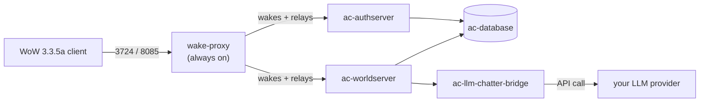

# wow-server-playerbots

[](https://github.com/estebanmorenoit/wow-server-playerbots/actions/workflows/ci.yml)
[](https://estebanmorenoit.github.io/wow-server-playerbots/)
[-4a5dc7)](#connecting-a-client)
[](https://www.azerothcore.org/)
[](./docker-compose.yml)
[](https://github.com/users/estebanmorenoit/packages/container/package/ac-wotlk-worldserver-playerbots)
[](./LICENSE)

Self-hosted **World of Warcraft: Wrath of the Lich King (3.3.5a, build 12340)** private server, built on [AzerothCore](https://www.azerothcore.org/) — solo-play focused, populated by AI bots instead of real players.

Not affiliated with Blizzard Entertainment. For personal/private-server use.

[MIT](./LICENSE) covers what's actually authored in this repo (`deploy.sh`, `backup.sh`, `wake-proxy/`, `status-page/`, `docker-compose.yml`, this README). It does *not* cover AzerothCore or the ten modules — `deploy.sh` clones those separately at deploy time, each under its own license (mostly AGPL-3.0/GPL-2.0).

## Contents

- [What's running](#whats-running)
- [Quick start](#quick-start)
- [Connecting a client](#connecting-a-client)
- [Modules](#modules)
- [GM commands reference](#gm-commands-reference)
- [Operations](#operations)

---

## What's running

- **Core**: AzerothCore (fork: [`mod-playerbots/azerothcore-wotlk`](https://github.com/mod-playerbots/azerothcore-wotlk), `Playerbot` branch), built as prebuilt images on GHCR — no build toolchain needed to run the server.
- **Database**: MySQL 8.4 (official image, not customized)
- **Orchestration**: Docker Compose
- **Auto-sleep**: the game stack fully stops when nobody's playing and wakes itself on the next connection attempt (~60-70s cold boot — your very first login after a break will show a connection error, then work normally on retry).



**Modules** (compiled into `worldserver`):

| Module | What it does |
|---|---|
| [mod-playerbots](https://github.com/mod-playerbots/mod-playerbots) | AI-controlled bot characters that populate the world |
| [mod-solocraft](https://github.com/azerothcore/mod-solocraft) | Scales dungeon/raid boss stats to your actual group size |
| [mod-llm-chatter](https://github.com/Hokken/mod-llm-chatter) | Bots chat dynamically via a real LLM instead of canned lines |
| [mod-ah-bot](https://github.com/NathanHandley/mod-ah-bot-plus) | Populates the Auction House with bot-driven listings — [setup](#auction-house-bot) |
| [mod-individual-progression](https://github.com/ZhengPeiRu21/mod-individual-progression) | Gates content by era (Vanilla → TBC → WotLK) on the same client |
| [mod-npc-buffer](https://github.com/azerothcore/mod-npc-buffer) | One-click buff NPC |
| [mod-cfbg](https://github.com/azerothcore/mod-cfbg) | Cross-faction battlegrounds, so the bot population fills PvP queues |
| [mod-account-achievements](https://github.com/azerothcore/mod-account-achievements) | Shares achievement progress across every character on your account |
| [mod-instance-reset](https://github.com/azerothcore/mod-instance-reset) | Reset your own dungeon/raid lockouts on demand |
| [mod-random-enchants](https://github.com/azerothcore/mod-random-enchants) | Small chance of a bonus enchant on looted/quest/crafted items |

**Verify an image's provenance** (SLSA attestation + SBOM, both attached at build time):
```bash
gh attestation verify oci://ghcr.io/estebanmorenoit/ac-wotlk-worldserver-playerbots:master --owner estebanmorenoit
```

---

## Quick start

**Without LLM-driven bot chat:**
```bash
./deploy.sh
```

**With it** — pick a provider and supply your key:
```bash
LLM_PROVIDER=google LLM_API_KEY=<your Gemini key> ./deploy.sh
```
`LLM_PROVIDER` is one of `anthropic`, `openai`, `google`, `openrouter`, or `ollama` (`ollama` needs no key; set `LLM_MODEL` for it). Re-running `deploy.sh` later with these set fills in your existing config without touching anything else.

`deploy.sh` is safe to re-run — it never overwrites an existing checkout, `.env`, or module config, only fills in what's missing.

**Realm address** — auto-detected from this host's LAN IP. Override if it picks the wrong one (multiple NICs, VPN, behind NAT):
```bash
REALM_ADDRESS=<your public or LAN IP> ./deploy.sh
```

**Admin account** — created automatically as `admin`/`test1234` (GM level 3). **Change that password if this host is reachable by anyone else:**
```bash
ADMIN_ACCOUNT_NAME=myaccount ADMIN_ACCOUNT_PASSWORD=<a real password> ./deploy.sh
```

**Add more accounts later:**
```bash
docker attach ac-worldserver
account create <username> <password>
account set gmlevel <username> 3 -1   # optional, grants GM access
```
Detach with `Ctrl-P` then `Ctrl-Q` — never `Ctrl-C` (kills the worldserver process).

> If you grant GM access to an account that's already logged in, GM commands fail as "unknown command" until you fully disconnect and log back in — AzerothCore only reads security level once, at login.

**Uninstalling:**
```bash
./deploy.sh --uninstall            # stop/remove containers+networks; keeps DB and checkout
./deploy.sh --uninstall --purge    # also deletes the database and checkout — PERMANENT
```

---

## Connecting a client

Requires a **3.3.5a (build 12340)** WotLK client.

1. Open `<WoW folder>/Data/enUS/realmlist.wtf` (match your locale, e.g. `enGB`, `deDE`)
2. Replace its contents with:
   ```
   set realmlist <YOUR_SERVER_IP>
   ```
3. Launch the client.

**First login after the server's been idle will likely show a connection error** — that's expected (see [Auto-sleep](#auto-sleep--wake-on-connect)). Wait a minute and log in again.

If chat is enabled, `docker logs ac-llm-chatter-bridge` should show five `[PASS]` lines. Any `[FAIL]` means bots won't chat until it's fixed.

---

## Modules

### Playerbots

Bot behavior is tuned via `docker-compose.yml` env vars, sized for a small (2-core) host — 100 random bots populating the world, capped AI tick rate. See `docker-compose.yml` itself for the exact settings and comments if you're tuning for different hardware.

**Commanding bots in-game:**
```
/invite <botname>                                — recruit a bot (or right-click their portrait)
.playerbots bot addclass <class> [male|female]   — add a random bot of a class to your party
.playerbots bot add <botname>                    — add a specific existing bot by name
.playerbots bot list                             — list your current bots
.playerbots bot remove <botname>                 — remove AND despawn a bot (plain /uninvite only drops it from your roster — it'll keep following you)
```
Valid classes: `warrior`, `paladin`, `hunter`, `rogue`, `priest`, `shaman`, `mage`, `warlock`, `druid`, `dk`.

Once a bot's in your party, whisper it **"help"** for its full order list (follow, stay, equip, spec, and more). Typing plain words like **`summon`** or **`leave`** in party chat also works as a command every bot in your group reacts to at once.

### Auction House bot

Ships with selling disabled — it needs a real character GUID first:

1. Log into the game with a character you're fine never playing again (browsing the AH with it can otherwise hang).
2. Find its GUID: target it and run `.guid`, or query `SELECT guid, name FROM characters WHERE name = 'YourCharName';`.
3. Edit `env/dist/etc/modules/mod_ahbot.conf`: set `AuctionHouseBot.GUIDs` to that GUID and `EnableSeller = true`.
4. `.ahbot reload` then `.ahbot update` (GM) to apply and force the first listing batch.

`.ahbot empty` clears bot-listed auctions to reset pricing (your own listings untouched).

### Progression

Gates world content by era (Vanilla → TBC → WotLK) on the same client. Enabled by default, assumes a fresh start (not meant to be added onto an already-leveled character). Check your tier: `.ip get [player]`.

### NPC Buffer / Instance Reset

Both ship enabled but need to be manually placed once:
```
.gm on
.npc add 601016     # Buffmaster Hasselhoof (one-click buffs)
.npc add 300000     # Instance reset NPC — won't reset the instance you're currently in
```

### Random Enchants

Small chance (tuned to ~15%/10%/5% for one/two/three bonus enchants) of extra stats on loot, quest rewards, crafted items, or group rolls. Configurable in `env/dist/etc/modules/random_enchants.conf`.

---

## GM commands reference

Verified against this exact core's command tables — some tutorials reference commands from other cores that don't exist here (e.g. there's no `.modify xp`).

**Basics**
```
.gm on / .gm off                          — toggle GM mode
.additem <id> [count]                     — add an item to your inventory
.character level <player> <level>         — set a character's level directly
.modify speed [all|walk|run|swim|flight|backwalk] <n>  — movement speed multiplier
.learn all my / .learn all gm             — learn your class's full spellbook / the GM spellbook
.revive [player]                          — resurrect
.cheat god|cooldown|casttime|power on/off — invulnerability / no cooldowns / instant cast / unlimited resources
.reload config                            — re-read worldserver.conf live
.account set gmlevel <account> <level> -1 — grant GM access, all realms
.gear repair [player]                     — repair all equipped items
.saveall                                  — force-save every online character now
```

**Teleport**
```
.tele <name>                              — teleport to a saved location
.tele add <name> / .tele del <name>       — save current location / delete a saved one
.tele group <name>                        — teleport your whole group
.appear <player> / .summon <player>       — teleport to a player / teleport a player to you
.cometome                                 — bring your current target to you
.recall                                   — return to before your last teleport
.unstuck                                  — rescue yourself from geometry
```

**NPCs & objects**
```
.lookup item|creature|spell <name>        — find IDs for .additem/.npc add/.learn
.guid                                     — GUID of your current target
.npc add <id> / .npc delete               — spawn / remove an NPC
.gobject near [radius] / .gobject add <id> — list nearby objects / spawn one
.respawn                                  — respawn the selected creature/object now
.respawn all                              — force-respawn everything in your current area
.quest complete <questId>                 — mark a quest complete (bypasses broken/missing completion triggers)
```

**Character & testing**
```
.die                                      — kill yourself instantly
.morph <displayid> / .demorph             — change appearance
.pinfo [player]                           — account + guild info
.maxskill                                 — max all of the selected player's skills for their level
```

**Module-specific**
```
.ahbot reload / .ahbot update / .ahbot empty   — apply config / force a listing cycle / clear bot listings
.ip get [player]                          — check mod-individual-progression's current tier
.playerbots bot add|addclass|list|remove   — see Playerbots above
```

`Rate.XP.Kill`/`Rate.XP.Quest`/`Rate.XP.Explore` etc. in `worldserver.conf` control XP rate server-wide (currently `2`, twice core default). Change and `.reload config` to apply live.

---

## Operations

### Backups

```bash
./backup.sh
```
Dumps every database to a timestamped, gzip-compressed file under `backups/` (gitignored). Runs automatically twice: once daily at 04:00 via cron, and once per play session right before the stack goes to sleep (so a session's data is never more than one sleep-cycle away from a backup). Old dumps prune after `BACKUP_RETENTION_DAYS` (default 30). These are local-only — copy `backups/` off-host for real disaster recovery.

Restore a dump:
```bash
gunzip -c backups/<file>.sql.gz | docker exec -i ac-database mysql -u root -p"$DB_ROOT_PASSWORD"
```

### Auto-sleep / wake-on-connect

`wake-proxy` holds the public ports open at all times and does nothing else while the game stack sleeps. The moment a client connects, it wakes everything and holds the connection through the cold boot. Five minutes after the last real player disconnects, it backs up the database and stops the game containers (leaving itself running for the next wake).

### Realm status page

`http://<this-host>:8090` — live population, world composition, and **your own recent play sessions**: level gained, gold earned, quests completed, achievements, reputation, and profession skill-ups per session, not just realm-wide stats. Falls back to cached numbers (clearly marked stale) when the realm's asleep.

### Monitoring

Optional standalone Prometheus + Loki + Grafana stack:
```bash
cd monitoring && docker compose up -d
```
- **Grafana**: `http://<this-host>:3000` (`admin`/`admin` — change it if reachable beyond your own network)
- **Prometheus**: `http://<this-host>:9090`

Two dashboards are pre-provisioned: Node Exporter Full and cAdvisor exporter, plus a custom Docker Logs dashboard.

### Migrating to another host

1. Install Docker + Compose, clone this repo, run `./deploy.sh` far enough to get `ac-database` healthy, then stop it *before* it imports a fresh schema.
2. Copy the database:
   ```bash
   docker exec ac-database mysqldump -u root -p"$DB_ROOT_PASSWORD" --all-databases > wow-server-backup.sql
   # on the new host, after `docker compose up -d ac-database`:
   docker exec -i ac-database mysql -u root -p"$DB_ROOT_PASSWORD" < wow-server-backup.sql
   ```
3. Copy secrets out-of-band (SCP, not git): `env/dist/etc/modules/mod_llm_chatter.conf` and the real `DB_ROOT_PASSWORD`.
4. Re-check bot count against the new host's core count — raise `AC_AI_PLAYERBOT_MAX_RANDOM_BOTS` if you have headroom, adjust `cpus`/`memory` limits to match.
5. Update or remove the `cpuset` lines in `docker-compose.yml` — they're pinned to the original host's exact CPU layout and will fail outright on a different one. Re-derive from the new host's `lscpu -e`, or delete them.
6. Open port 3724 (and 8085) in the new host's firewall, then update `realmlist.wtf` on any client.
